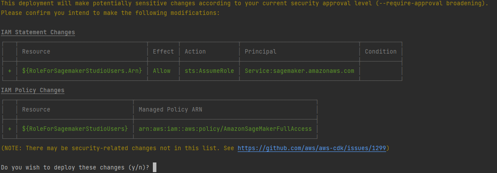

# Build and automatize the management of your Sagemaker Studio Users using AWS CDK!

You should explore the contents of this project. It demonstrates a CDK app with an instance of a
stack (`sagemakerStudioCDK`)

The `cdk.json` file tells the CDK Toolkit how to execute your app.

## Deployment Steps

Pre-requisites:

* An AWS profile with permissions to create AWS Identity and Access Management (AWS IAM) roles, Studio domains, and Studio user profiles
* AWS CLI, authenticated and configured
* Python 3.6+
* AWS CDK
* Git
* Knowledge on how Amazon Sagemaker Studio works.

Step 1: Using your device’s command line, check out our Git repository to a local directory on your device:

`git clone https://github.com/aws-samples/aws-cdk-sagemaker-studio`

Step 2: Change directories to the new directory that was created during the previous step:

`cd aws-cdk-sagemaker-studio/`

Step 3: Create a virtual environment:

`macOS/Linux: python3 -m venv .cdk-venv`  
`Windows: python -m venv .cdk-venv`

Step 4: Activate the virtual environment after the init process completes, and the virtual environment is created:

`macOS/Linux: source .cdk-venv/bin/activate`  
`Windows: .cdk-venv\Scripts\activate.bat`

Step 5: Install the required dependencies:

`pip3 install -r requirements.txt`

Step 6: Synthesize the templates. AWS CDK apps use code to define the infrastructure, and when run, they produce, or
“synthesize” an AWS CloudFormation template for each stack defined in the application:

`cdk synthesize`

Step 7: Deploy the solution.

`cdk deploy`

Review the resources that AWS CDK creates for you in your AWS account and choose yes to deploy the stack.

Wait for your stack to be deployed by checking the status on the AWS CloudFormation console.

Enjoy!

## Useful commands

* `cdk ls`          list all stacks in the app
* `cdk synth`       emits the synthesized CloudFormation template
* `cdk deploy`      deploy this stack to your default AWS account/region
* `cdk diff`        compare deployed stack with current state
* `cdk docs`        open CDK documentation

## Cleanup

Follow this step to remove the resources that were deployed in this post.

`cdk destroy`

When asked to confirm the deletion of the four stacks, select “`y`”.

## Security

See [CONTRIBUTING](CONTRIBUTING.md#security-issue-notifications) for more information.

## License

This library is licensed under the MIT-0 License. See the LICENSE file.

